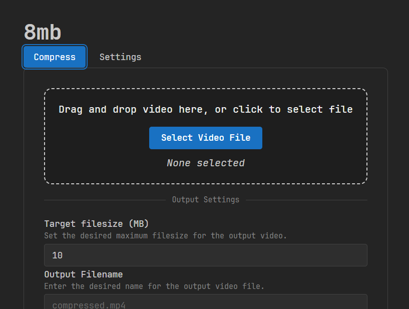

# 8mb-electron

File size compression software using FFmpeg for Windows.



## Features

- Compression of videos with one click
- Easy PC to Phone file transfer using QR codes. (One way)

## Running in the development environment

1. Run `npm install`.
2. Start the renderer dev server and Electron together:

```bash
npm run dev
```

This runs Vite (renderer) and Electron concurrently.

To run only Electron (legacy start):

```bash
npm start
```

## File access

This program will access your user data folder in order to store configuration files.

- Default Output Folder
- Dependencies required for the program to work (FFmpeg)
- Program does not include FFmpeg out of the box

## License

This project is licensed under the GNU General Public License v3.0. See LICENSE for the full text.
This software makes use of FFmpeg (https://ffmpeg.org). FFmpeg is not distributed with this software.

## Source code

- FFmpeg source: https://ffmpeg.org/download.html

- gyan.dev build info: https://www.gyan.dev/ffmpeg/builds/
